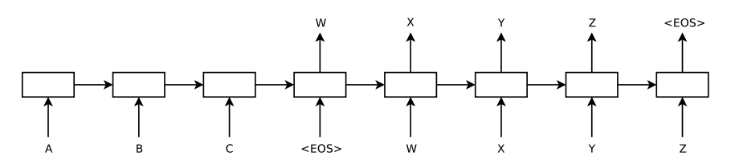

# seq2seq_pytorch
This repository reimplement Seq2Seq model by PyTorch.  
paper: Sequence to Sequence Learning with Neural Networks  
(https://papers.nips.cc/paper/5346-sequence-to-sequence-learning-with-neural-networks.pdf)

 

### Getting Started

## Install Required Packages
First ensure that you have installed the following required packages.  
```
pip install -r requirements.txt
```

- python 3.6.8
- numPy 1.15.1
- pandas 0.23.4
- PyTorch 1.0.1
- tqdm 4.26.0
- janome


## Prepare the Dataset

## Prepare the Vocaburary

## Training Seq2Seq Model